Studio-Canvas
=============

**Real-Time Virtual Studio Canvas Rendering**

About
-----

**Studio-Canvas** is a client/server applications for dynamically
rendering the virtual canvas of a filmstudio through the help of a game
engine. The canvas optionally is overlayed with a standalone monitor
and/or an embedded decal, both showing an own video stream. The virtual
cameras optionally can follow the physical PTZ cameras throught their
emitted FreeD information.

The application, written in [TypeScript](https://www.typescriptlang.org/),
consists of a central [Node.js](https://nodejs.org)-based server component and
a HTML5 Single-Page Application (SPA) as the client component.
The client component it turn runs in two distinct modes: a
[Vue.js](https://vuejs.org/) based control mode for real-time adjusting
the scene parameters and a rendering mode for real-time rendering the
scene with the help of the [Babylon.js](https://www.babylonjs.com/) game
engine.

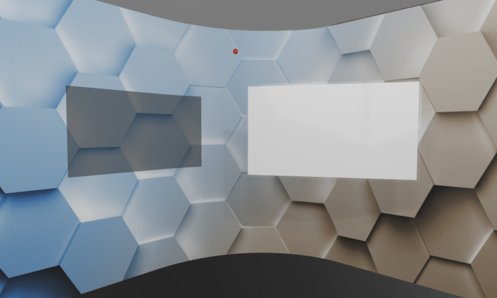

Control User Interface
----------------------

**Studio-Canvas** is based on a client/server architecture.
The client runs in either control mode or render mode. The
render client(s) are remote controlled from control client(s).
Here are screenshots of the user interface of the control client.

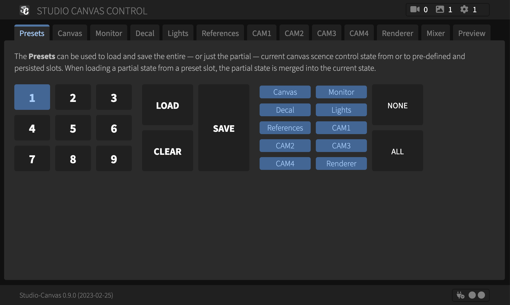
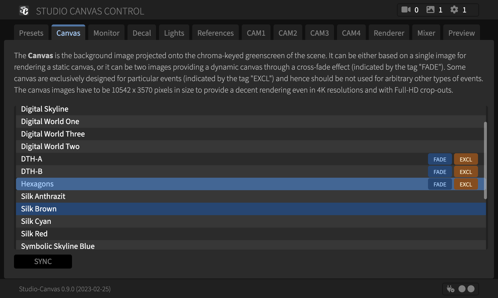
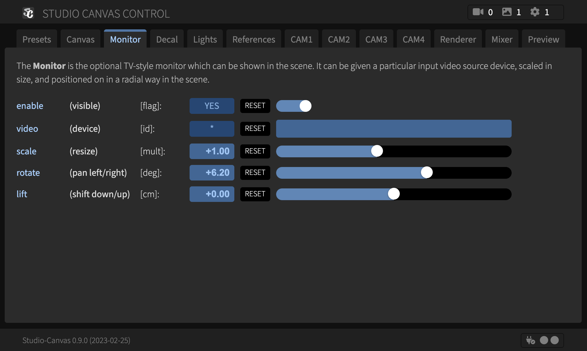
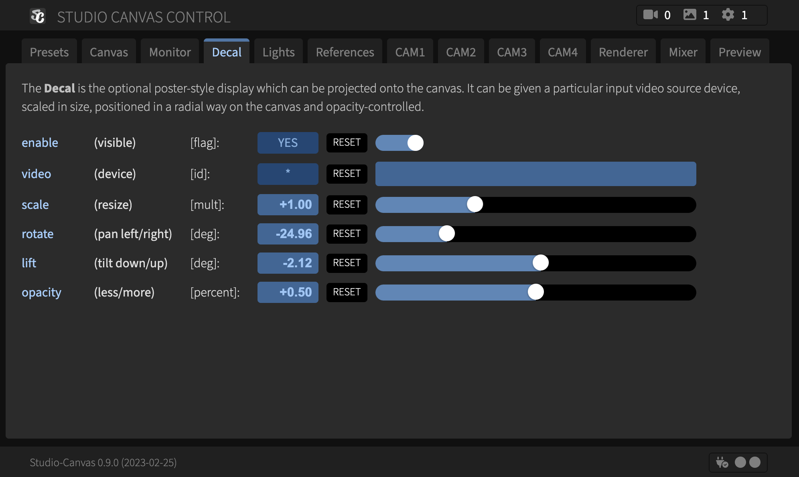
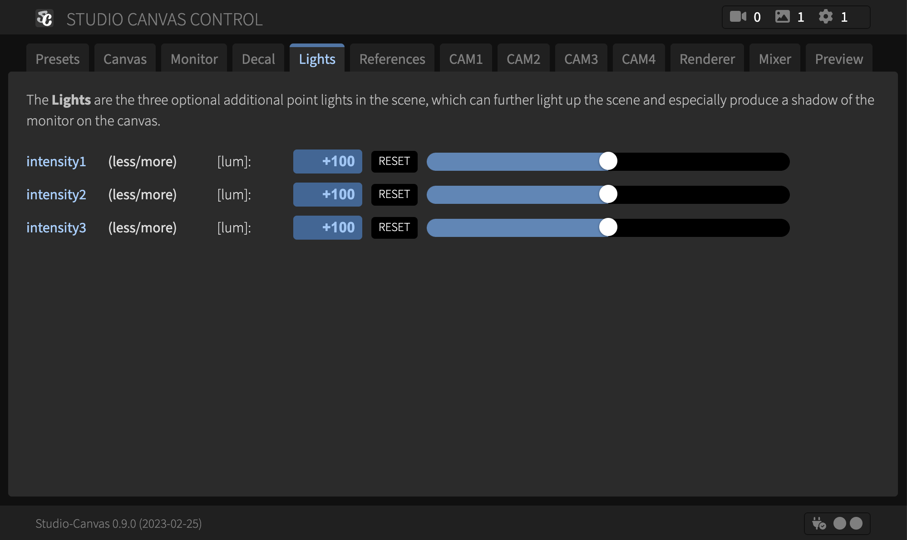
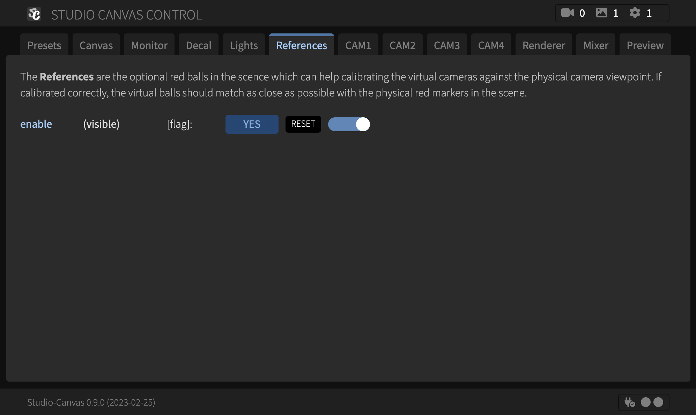
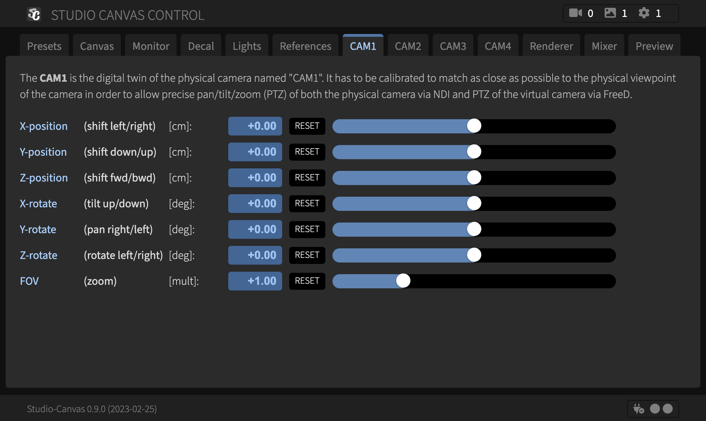
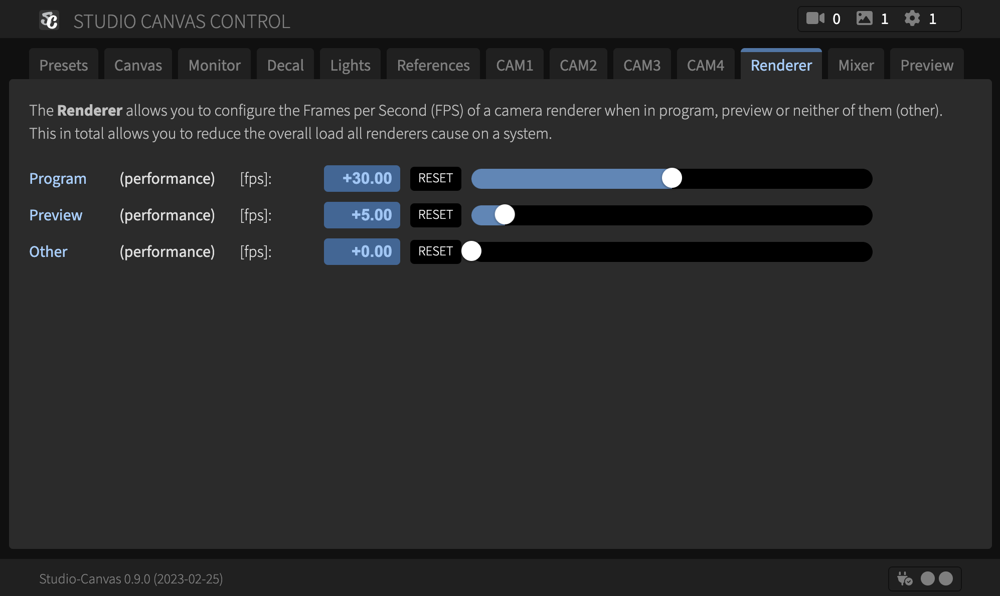
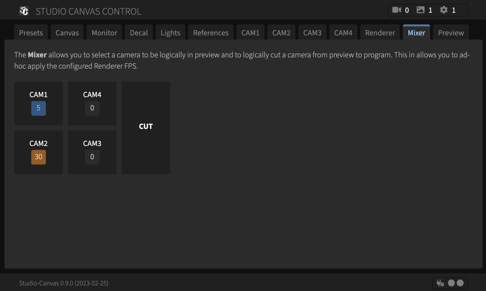
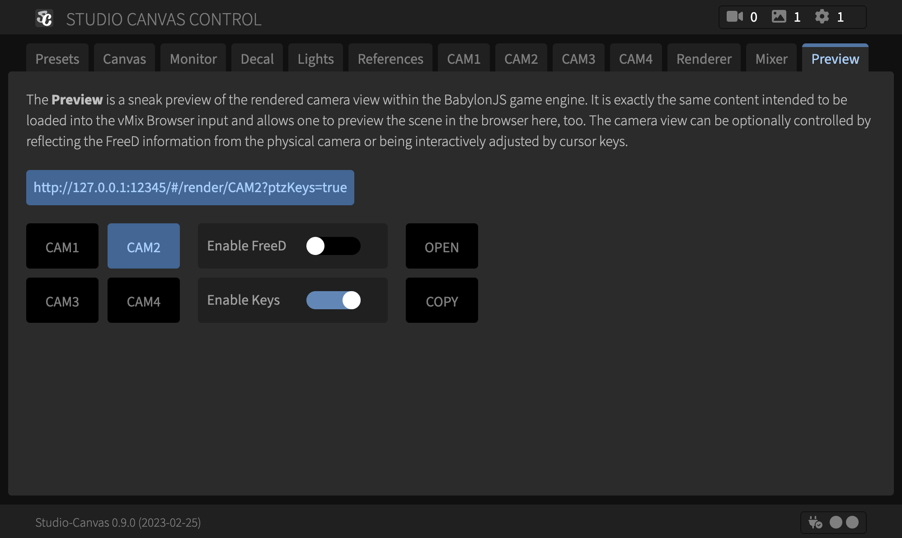

Usage (Production)
------------------

- Under Windows/macOS/Linux install [Node.js](https://nodejs.org)
  for the server run-time, [Google Chrome](https://www.google.com/chrome)
  for the client run-time (control mode and either [OBS Studio](https://obsproject.com)
  or [vMix](https://www.vmix.com) for the client run-time (renderer mode).

- Install all dependencies: 
  `npm install --production`

- Run the production build-process once: 
  `npm start build`

- Run the bare server component: 
  `npm start server`

- Open the client component (control mode) in Google Chrome: 
  https://127.0.0.1:12345/

- Use the client component (renderer mode) in OBS Studio or vMix browser sources: 
  https://127.0.0.1:12345/#/render/back/CAM2?ptzFreeD=true

Usage (Development)
-------------------

- Under Windows/macOS/Linux install [Node.js](https://nodejs.org)
  for the server run-time and [Google Chrome](https://www.google.com/chrome)
  for the client run-time (both control mode and renderer mode),
  plus [Visual Studio Code](https://code.visualstudio.com/) with its
  TypeScript, ESLint and VueJS extensions.

- Install all dependencies: 
  `npm install`

- Run the development build-process once: 
  `npm start build-dev`

- Run the development build-process and server component continuously: 
  `npm start dev`

- Open the client component (control mode) in Google Chrome: 
  https://127.0.0.1:12345/

- Open the client component (renderer mode) in Google Chrome: 
  https://127.0.0.1:12345/#/render/back/CAM2?ptzFreeD=true

Architecture
------------

**Studio-Canvas** is based on a Client/Server architecture,
as illustrated in the following diagram:

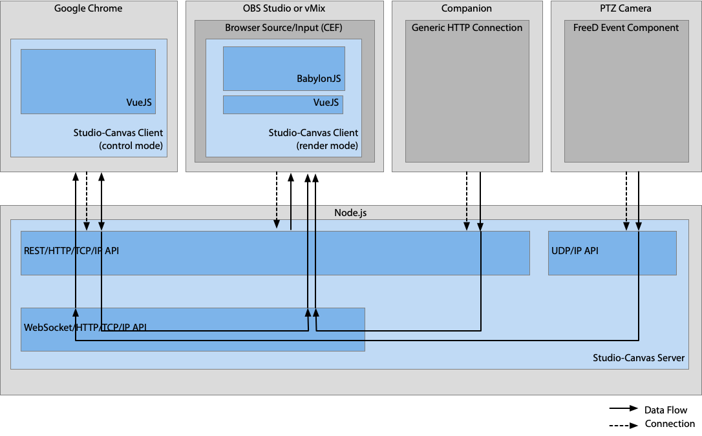

See Also
--------

- [TypeScript](https://www.typescriptlang.org/)
- [Vue.js](https://vuejs.org/)
- [BabylonJS](https://babylonjs.com)
    - [BabylonJS Documentation](https://doc.babylonjs.com/)
    - [BabylonJS Playground](https://playground.babylonjs.com/)
    - [BabylonJS Sandbox](https://sandbox.babylonjs.com/)
    - [BabylonJS Node Material Editor (NME)](https://nme.babylonjs.com/)
    - [BabylonJS Editor](https://editor.babylonjs.com/)
- [Node.js](https://nodejs.org)
- [Blender](https://blender.org)

Copyright & License
-------------------

Copyright &copy; 2023-2024 [Dr. Ralf S. Engelschall](mailto:rse@engelschall.com) 
Licensed under [GPL 3.0](https://spdx.org/licenses/GPL-3.0-only)

